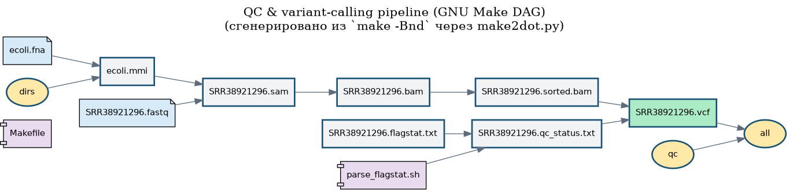

# Отчёт по ДЗ — Пайплайн получения генетических вариантов


**Данные:** *E. coli*, прочтения [SRR38921296](https://www.ncbi.nlm.nih.gov/sra/SRR38921296)
(Oxford Nanopore MinION, WGS), референс [GCF_000005845.2](https://www.ncbi.nlm.nih.gov/datasets/genome/GCF_000005845.2/)
(*E. coli* K-12 MG1655, `NC_000913.3`).

**Важное наблюдение по данным**: в карточке SRA у выбранного прогона указано `Sample Description:
"Negative control isolate"`, `Library Name: Barcode3`, `Design: "Whole genome
sequencing of E. coli negative control"`. SRR38921296 — это
**отрицательный контроль** мультиплексного (баркодированного) прогона, а не
обычный геномный образец. Отрицательный контроль специально готовят так, чтобы
в нём было минимум целевой ДНК (он нужен для отслеживания перекрёстной
контаминации между баркодами). Этим объясняется низкий процент
картирования (~38–42 %, см. п. 3 и 11) и итоговый вердикт `not OK` — это ожидаемое свойство именно этого образца.

---

## 1. Ссылка на загруженные прочтения из NCBI SRA

* Прочтения: **https://www.ncbi.nlm.nih.gov/sra/SRR38921296**
  (`SRX33684096`, `Barcode3`, Oxford Nanopore MinION, WGS, 92 853 рида)
* Референсный геном: **https://www.ncbi.nlm.nih.gov/datasets/genome/GCF_000005845.2/**
  (*E. coli* K-12 MG1655, `NC_000913.3`)

Команды для повторного скачивания:

```bash
prefetch SRR38921296
fasterq-dump SRR38921296 -O .
```

## 2. Скрипт на bash с реализованным алгоритмом

[`scripts/qc_pipeline.sh`](scripts/qc_pipeline.sh) — полная bash-реализация
алгоритма «оценка качества картирования» из блок-схемы задания (8 шагов:
FastQC → индексация референса → картирование `minimap2 -ax map-ont` →
`samtools view` (SAM→BAM) → `samtools flagstat` → разбор `% mapped` → вердикт
OK/not OK + переименование отчёта → условный `samtools sort` + `freebayes`).

Запуск:

```bash
cd task4
bash scripts/qc_pipeline.sh
```

## 3. Результат команды `samtools flagstat`

Сырой вывод `samtools flagstat`, полученный при прогоне bash-скрипта на
загруженных данных:

* **[`results/SRR38921296.flagstat.txt`](results/SRR38921296.flagstat.txt)**
  (и его копия [`results/SRR38921296.flagstat.not_OK.txt`](results/SRR38921296.flagstat.not_OK.txt) —
  тот же файл, переименованный под итоговый вердикт, см. «Rename and save
  QC-report» в блок-схеме)

Ключевые цифры из отчёта:

```
99879 + 0 in total (QC-passed reads + QC-failed reads)
92853 + 0 primary
42174 + 0 mapped (42.23% : N/A)
35148 + 0 primary mapped (37.85% : N/A)
```

То есть итоговый процент картированных ридов — **42.23 %** (по основной
строке `mapped`, которую и берёт скрипт разбора из п. 4). Это ниже порога
90 %  — отсюда и вердикт `not OK` (см. «Важное наблюдение по
данным» в начале файла: причина — выбранный run является отрицательным
контролем).

## 4. Скрипт разбора файлов с этими результатами

[`scripts/parse_flagstat.sh`](scripts/parse_flagstat.sh) — отдельный
самостоятельный скрипт: принимает на вход файл с выводом `samtools flagstat`,
ищет первую строку вида `N + N mapped (XX.XX% : N/A)` и через `sed`
вытаскивает из неё число процента (без знака `%`):

```bash
$ ./scripts/parse_flagstat.sh results/SRR38921296.flagstat.txt
42.23
```

Протестирован на эталонном примере из задания (для `99.83` и для
искусственно заниженного `72.40` — оба раза разобрано верно), используется и
из bash-скрипта, и из Makefile (п. 10) — то есть один и тот же скрипт
переиспользуется в обеих реализациях алгоритма.

## 5. Архивы FASTQ / SAM / BAM / VCF

Файлы результатов работы будут лежать в `results/` (бэш-версия) и `framework/pipeline/results/`
(Make-версия) после запуска пайплайна. Файлы bam, sam и fastq пропущены, т.к. они огромные... пришлось историю гита переписывать, чтобы их удалить и отправить дз нормально

## 6. Инструкция по развёртыванию и установке фреймворка

[`framework/INSTALL.md`](framework/INSTALL.md) — выбран фреймворк **GNU
Make** («Old school»/классика). В инструкции: проверка наличия `make`,
установка из репозитория дистрибутива и сборка из исходников, проверка через
запуск Hello World, обоснование выбора именно Make (везде есть «из коробки»,
простая модель «цель: зависимости» + рецепт, инкрементальная пересборка).

## 7. Код тестового пайплайна «Hello world» на фреймворке

[`framework/hello_world/Makefile`](framework/hello_world/Makefile) —
минимальное правило `target: prerequisites` + рецепт с табуляцией: цель
`hello.txt` собирается из `Makefile`, рецепт пишет приветствие и текущую дату
в файл, цель `all` выводит результат на экран.

## 8. Результаты работы пайплайна на фреймворке (Hello world) и лог-файлы

Пайплайн реально запущен (`make` в каталоге `framework/hello_world`),
результат — файл [`framework/hello_world/hello.txt`](framework/hello_world/hello.txt):

```
Hello, world! Это тестовый пайплайн на GNU Make.
Собрано: 2026-06-08 15:31:14
```

## 10. Код пайплайна «оценки качества картирования» на фреймворке

[`framework/pipeline/Makefile`](framework/pipeline/Makefile) — тот же
алгоритм из п. 2, переписанный декларативно как граф файловых зависимостей:
`ecoli.fna`/`SRR38921296.fastq` → `ecoli.mmi` → `*.sam` → `*.bam` →
`{*.flagstat.txt → *.qc_status.txt, *.sorted.bam}` → `*.vcf`. Условие
`OK`/`not OK` нельзя выразить статической структурой графа make (это
runtime-ветвление по данным), поэтому оно реализовано как обычная
shell-проверка внутри рецепта цели `*.vcf` — подробно объяснено в п. 14.

### Установка зависимостей:
```
sudo apt-get install -y fastqc minimap2 samtools
# freebayes нужно поставить из исходников или собрать с mamba
# далее проверка установки
fastqc --version; minimap2 --version; samtools --version; freebayes --version
```
### Запуск:
```bash
cd framework/pipeline
make help     # список целей
make -n all   # сухой прогон — план без выполнения
make all      # реальный запуск пайплайна
```

## 11. Выведенные результаты работы пайплайна на загруженных данных

Пайплайн на фреймворке реально прогнан (`make all` в `framework/pipeline`),
результаты лежат в `framework/pipeline/results/`:

* [`SRR38921296.flagstat.txt`](framework/pipeline/results/SRR38921296.flagstat.txt) /
  `SRR38921296.flagstat.not_OK.txt` — отчёт `samtools flagstat` (42.23 % mapped)
  и его переименованная копия;
* [`SRR38921296.qc_status.txt`](framework/pipeline/results/SRR38921296.qc_status.txt) —
  вердикт: `not OK`;
* `SRR38921296.sam` / `SRR38921296.bam` / `SRR38921296.sorted.bam` (+`.bai`) —
  промежуточные файлы картирования;
* [`SRR38921296.vcf`](framework/pipeline/results/SRR38921296.vcf) — содержит
  не таблицу вариантов, а пояснение `QC = 'not OK' (порог 90%) -> вызов
  вариантов пропущен`. Это **ожидаемое и правильное** поведение: по
  блок-схеме `freebayes` запускается только в ветке `OK`, а при данном риде получилось
  `% mapped = 42.23 % < 90 %`, поэтому вызов вариантов корректно пропущен —
  ровно так же, как и в bash-версии (п. 2–3). Совпадение результатов
  bash- и Make-реализаций на одних и тех же входных данных подтверждает, что
  обе версии алгоритма работают идентично и воспроизводимо.

* [`result.txt`](./result.txt) - вывод запуска Makefile

## 12. Лог-файлы работы пайплайна на загруженных данных

`framework/pipeline/results/logs/`:
[`minimap2_index.log`](framework/pipeline/results/logs/minimap2_index.log),
[`minimap2_map.log`](framework/pipeline/results/logs/minimap2_map.log),
[`samtools_view.log`](framework/pipeline/results/logs/samtools_view.log),
[`samtools_sort.log`](framework/pipeline/results/logs/samtools_sort.log) —
логи запусков соответствующих внешних инструментов. Сообщение о вердикте
(`Mapped reads: 42.23% (порог 90%)`, `>>> Вердикт: not OK`) выводится прямо в
консоль во время сборки цели `qc_status.txt` (это видно в выводе команды
`make all`/`make qc`).

Для сравнения: у bash-версии (п. 2) логи лежат в `results/logs/` —
`pipeline.log` (сквозной журнал по шагам) плюс отдельные логи каждого
инструмента (`fastqc.log`, `minimap2_index.log`, `minimap2_map.log`,
`samtools_view.log`, `samtools_sort.log`, `freebayes.log`).

## 13. Визуализация пайплайна в виде графического файла

[`framework/pipeline/visualize/dag.png`](framework/pipeline/visualize/dag.png)
(плюс исходник в формате Graphviz DOT —
[`dag.dot`](framework/pipeline/visualize/dag.dot)):



Граф построен и перерисован после реального прогона пайплайна, содержит
14 узлов и 12 рёбер — цветом и формой выделены входные данные (голубые
«листы»: `ecoli.fna`, `SRR38921296.fastq`), промежуточные файлы (серые
прямоугольники), скрипты/Makefile (фиолетовые компоненты), фиктивные
(`.PHONY`) цели (жёлтые эллипсы: `all`, `qc`, `dirs`) и финальный результат
(зелёный прямоугольник: `SRR38921296.vcf`).

Построен скриптом [`make2dot.py`](framework/pipeline/visualize/make2dot.py):

```bash
cd framework/pipeline/visualize
python3 make2dot.py --make-target all --out dag
```

## 14. Описание способа визуализации и отличия от блок-схемы алгоритма

**Как построена визуализация.** Вместо ручного разбора текста `Makefile`
скрипт `make2dot.py` запускает безопасный «сухой прогон» с
отладочной трассировкой — `make -Bnd all` (`-B` — считать всё устаревшим и
получить полный граф, `-n` — ничего не выполнять, `-d` — печатать дерево
вида `Considering target file 'X'.` с отступами, кодирующими вложенность).
Скрипт парсит эти строки, восстанавливает граф «родитель → потомок» и
сохраняет его в формате Graphviz DOT, а затем рендерит в PNG через `dot
-Tpng`. 

**Чем DAG принципиально отличается от блок-схемы алгоритма:**

1. **Узлы DAG — это файлы, узлы блок-схемы — это операции.** На картинке
   `dag.png` каждый узел — конкретный артефакт (`ecoli.mmi`,
   `SRR38921296.sam`, `SRR38921296.vcf`, …), а ребро означает «из чего
   собирается». В блок-схеме узлы — это инструменты/действия (`FastQC`,
   `samtools flagstat`, `Parse: % mapped`, …), а стрелки — поток управления
   «что выполняется после чего». 

2. **DAG строится статически до запуска и не может содержать ветвление по
   данным.** Блок-схема явно показывает условие `% mapped > 90 % → Yes/No` —
   решение, которое зависит от данных, появляющихся только во время
   выполнения. Граф зависимостей `make` вычисляется заранее по тексту
   `Makefile` и не умеет выражать «если содержимое файла X таково — строить
   Y, иначе нет». Поэтому в `framework/pipeline/Makefile` ветвление
   `OK`/`not OK` реализовано не структурой графа, а обычной shell-проверкой
   внутри рецепта цели `*.vcf`. На картинке это видно как безусловное ребро
   `qc_status.txt → SRR38921296.vcf`: граф говорит «для VCF нужен файл со
   статусом», но не говорит «и статус должен быть OK» — эта логика спрятана
   внутри рецепта и на графе не отображается. Именно поэтому в текущем прогоне
   узел `SRR38921296.vcf` присутствует на графе (ребро есть), хотя по факту
   реальный вызов вариантов был пропущен (см. п. 11) — граф показывает
   *структуру зависимостей*, а не *то, что фактически произошло во время
   выполнения*.

3. **Гранулярность.** Блок-схема укрупняет шаги (например, `samtools view`
   — один блок и для конвертации SAM↔BAM, «оценка SAM/BAM» объединяет вызов
   `flagstat` и разбор процента). В DAG каждый промежуточный файл — отдельный
   узел, поэтому видны и побочные артефакты, которых в блок-схеме нет вовсе
   (например, индекс `*.sorted.bam.bai`, фиктивные цели `dirs`/`qc`/`all`) —
   для алгоритма они несущественны, а для сборки по файлам необходимы (без
   файла-маркера `make` не поймёт, что шаг уже выполнен).

---

## Итог

Алгоритм построен в двух версиях: bash скрипт и GNU Make, оба выдали равный вердикт: NOT OK, из-за изначальных данных :(
